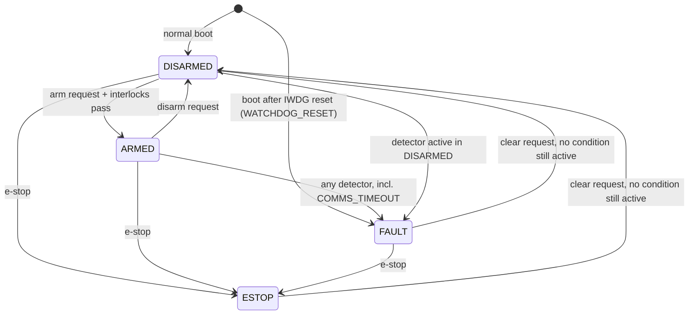

# Safety state machine — theory

Derivations behind [ADR 0014](../decisions/0014-safety-state-machine.md) and the code in
[`firmware/core/safety/`](../../firmware/core/safety/). Every timing bound asserted in
`tests/cpp/test_safety_supervisor.cpp` and `tests/cpp/test_sil_safety.cpp` is derived here.

**Distances use the placeholder plant** (`sim/sim/wheel_plant.hpp`): coast τ = 0.5 s, brake
τ = 0.05 s, top speed 9 rad/s × 52.5 mm ≈ 0.47 m/s. None are measured. The structure of each
formula holds for the real robot; the numbers will change.

## Variables

| Symbol | Meaning | Default | Unit |
|---|---|---|---|
| T_c | `comms_timeout_ms` | 200 | ms |
| T_b | `fault_brake_delay_ms` | 800 | ms |
| T_s | `wheel_stall_ms` | 500 | ms |
| T_o | `loop_overrun_fault_us` | 5000 | µs |
| T_w | IWDG timeout, `kIwdgTimeout_ms` (build constant) | 50 | ms |
| T | Motor-loop period | 1 | ms |
| N | Speed-estimator window (`wheel_speed_window_samples`) | 10 | samples |
| τ_c, τ_b | Wheel spin-down time constant when coasting, braking | 0.5, 0.05 | s |
| v_0 | Robot speed when the stop begins | 0.47 | m/s |
| u_lim | `wheel_duty_limit` | 0.3 | — |
| K | Plant gain, rad/s per unit duty | 31.4 | rad/s |

## 1. The machine



There is no edge into ARMED except from DISARMED, so re-arming after any trouble always takes
two operator requests. The full state × event table, with the Nack and Fault frame each pair
produces, is `kTable` in `tests/cpp/test_safety_supervisor.cpp`. The test fails if any pair
is missing, so the table *is* the specification.

| State | `drive_armed` | Wheels | Pitch stage |
|---|---|---|---|
| DISARMED | false | coast | off |
| ARMED | true | velocity loop | on |
| FAULT | false | coast for T_b, then brake | on **only** if COMMS_TIMEOUT is the only flag (Q6) |
| ESTOP | false | brake | off |

### 1.1 Order inside one tick

`SafetySupervisor::step()` runs once per 1 kHz motor-loop tick, in this order:

1. **E-stop.** Nothing later in the tick can delay or undo it.
2. **Detectors**: LOOP_OVERRUN, ENCODER_FAULT, MOTOR_DRIVER_FAULT, then WHEEL_STALL (ARMED only).
3. **Comms watchdog**: feed from this tick's frames, then check for timeout.
4. **The operator request**, judged on whatever state steps 1–3 left.
5. **Outputs.**

The order settles every same-millisecond race in the safe direction. An arm request in the
tick a fault appears sees FAULT and is refused. A clear request in the tick a condition is
still present finds it active and is refused. An e-stop and an arm in one tick end in ESTOP.

## 2. Comms watchdog

Let t_f be the MCU receive time of the last feeding frame. The supervisor trips when

```
elapsed_us(t_f, t_now) >= T_c
```

so with T_c = 200 ms a command received at t_f trips on the tick at exactly t_f + 200 ms
(`TripsAtExactly200msAfterTheLastDriveCommand`: 199 → ARMED, 200 → FAULT, 201 → FAULT). Ticks
are 1 ms apart and frames are decoded at tick boundaries, so detection is exact to the tick.

**What feeds it.** In DISARMED, any valid operator frame. In ARMED, only DriveCommand. The
case this catches: an operator app whose input thread has crashed while its heartbeat thread
still runs. A Heartbeat-fed watchdog would keep the robot driving the last stick position
forever.

**Receive time, not frame time.** The frame's `timestamp_us` comes from the operator's clock,
which is not synchronised with the MCU's. Only `Clock::now_us()` at decode means anything to
the MCU.

**Worst-case stale control.** Between commands the MCU keeps acting on the last one, so after
a link loss the robot drives the last command for up to T_c before the fault even begins:

```
d_stale = v_0 · T_c = 0.47 m/s × 0.2 s = 94 mm
```

### 2.1 Wraparound

`elapsed_us` is correct only for intervals under 2³² µs ≈ 71.6 min. A DISARMED robot can sit
idle for longer than that with no frames. If the freshness check were a bare subtraction, a
heartbeat 71.6 min + 1 ms old would read as 1 ms old, and arming would pass interlock 3.

The fix is a **latch**: `link_fresh_` goes false the first time the silence reaches T_c, and
only a new feed sets it true again. The supervisor is stepped every millisecond, so it always
sees the silence cross T_c long before 2³² µs. Every other timer in the module is bounded the
same way:

| Timer | Bounded by |
|---|---|
| link freshness | `link_fresh_` latches false at T_c |
| fault → brake | `fault_braking_` latches true at T_b |
| wheel stall | trips at T_s, and the detector resets when leaving ARMED |
| loop gap | measured between consecutive 1 ms steps |

`TheStaleLinkCheckSurvivesAClockWrapAfterALongIdle` idles for 2³² µs + 50 ms and checks the
latch holds.

## 3. Stopping: coast, then brake

A first-order spin-down from v_0 with time constant τ covers

```
d(t) = v_0 τ (1 − e^{−t/τ})          speed left: v(t) = v_0 e^{−t/τ}
```

| Policy | Distance from v_0 = 0.47 m/s |
|---|---|
| brake immediately: v_0 τ_b | 23.5 mm |
| coast T_b = 0.8 s: v_0 τ_c (1 − e^{−1.6}) = 188 mm, then brake from 0.095 m/s: 4.7 mm | **192 mm** |
| coast forever: v_0 τ_c | 235 mm |

After 800 ms of coasting the speed is e^{−1.6} = **20%** of v_0 (checked by the link-cut SIL
test: between 15% and 25%). On flat ground the late brake adds little. It is there for the
slope: free rolling on 10° accelerates at g sin 10° = 1.70 m/s², and in 0.8 s from rest
that covers ½ · 1.70 · 0.8² = **0.55 m**. How hard the N20 gearbox is to back-drive decides the
real figure ([UNCLEAR], measure at bring-up).

A link loss stops on this schedule, measured from the **last command received**:

```
t_fault = t_f + T_c = +200 ms   (coast)        t_brake = t_fault + T_b = +1000 ms
```

ESTOP brakes on the tick it is decoded. The SIL test measures this end to end through the
UART, at ≤ 2 ms from send.

## 4. WHEEL_STALL

### 4.1 Why it is needed: a frozen encoder holds the integrator

The wheel controller is a PI with conditional-integration anti-windup (ADR 0013):

```
u = kp · e + I,     dI/dt = ki · e  (only while u is not saturated in the direction of e)
e = w_ref − w_meas
```

Unplug the encoder and `w_meas` reads a **valid** 0. With the stick pushed, e = w_ref > 0, so
u climbs to u_lim and the wheel runs at K · u_lim = 9.4 rad/s with nothing controlling it.
Now centre the stick: w_ref = 0 and w_meas = 0, so **e = 0**. The P term is zero, and the
integrator stops changing *but keeps its wound-up value*. The wheel keeps running at the duty
limit, and centring the stick cannot stop it.

A **reversed** encoder fails in a similar way. w_meas = −w, so e = w_ref + w grows as the
wheel speeds up: positive feedback. u saturates at +u_lim, and the wheel reads −9.4 rad/s,
the opposite sign to its duty.

### 4.2 The condition

```
saturated:  |u| ≥ u_lim − 10⁻⁴                        (and u_lim > 0)
stalled:    saturated  AND  speed valid  AND  ( |w_meas| < 1 rad/s  OR  sign(w_meas) = −sign(u) )
trip:       stalled continuously for T_s
```

- **1 rad/s threshold.** Over the N = 10 sample window, 1 rad/s is
  1 × 0.01 s × 1400 / 2π = **2.2 counts**, comfortably above the 1-count resolution of
  0.449 rad/s, so quantisation cannot make a slowly turning wheel look stopped.
- **Saturation alone never trips it.** On ADR 0013's carpet plant (load d = 0.05, extra drag
  c = 0.5) holding 9 rad/s needs u = d + (1 + c) w / K = 0.05 + 1.5 × 9 / 31.4 = **0.48**, above
  the 0.3 limit, so the loop saturates. But the wheel still turns at
  w = K (u_lim − d) / (1 + c) = 31.4 × 0.25 / 1.5 = **5.2 rad/s** the right way, well above
  1 rad/s. `FullStickOnCarpetSaturatesWithoutAFault` checks that the case really does saturate.
- **T_s = 500 ms** is 500 / 20 = **25** closed-loop time constants (τ_cl = 20 ms, ADR 0013).
  ADR 0014 says "about 10"; that is an arithmetic slip, corrected by a dated callout in the
  ADR. The conclusion holds more strongly: no legitimate transient sits at the limit, near
  zero speed, for 25 τ_cl. The schema's `source` note for `wheel_stall_ms` carries the
  corrected figure.
- **Pushing into a wall trips it.** That is wanted: holding the duty limit against a wall
  only heats the motor.

### 4.3 Trip-time bound for an unplugged encoder

After the freeze, the windowed estimate falls to 0 over at most N·T = 10 ms. The error then
needs only kp · e = 0.0796 × 3.81 = 0.30 to reach u_lim, which it does within a few ms. Then
T_s more:

```
T_s  ≤  t_trip − t_freeze  ≤  N·T + t_sat + T_s  ≈  10 + 5 + 500 = 515 ms
```

`AFrozenEncoderLatchesWheelStallAndTheRobotStops` asserts [500, 515] ms.

## 5. LOOP_OVERRUN

The supervisor is stepped by the motor loop, so the gap between two of its own steps *is* the
motor-loop gap. It needs no timer and stays pure. An extra delay T_d in a loop with crossover
ωc costs ωc · T_d of phase margin:

```
ωc · T_o = 50 rad/s × 5 ms = 0.25 rad = 14°      (ADR 0013's 74° → 60°)
```

The trip is `gap > T_o`, strict, so exactly 5000 µs is tolerated and 5001 µs trips (both
tested). Smaller overruns are only counted, in `LoopTiming.overrun_count`, by the timing glue.
A loop that stops entirely never steps the supervisor again; catching that is the IWDG's job.

## 6. Hardware watchdog and check-ins

The STM32 timers keep generating PWM when the CPU stops, so a hung core drives at its last
duty until the IWDG resets the chip:

```
d_hang = v_0 · T_w = 0.47 × 0.05 = 23.5 mm     (21–26 mm across the LSI's ±10%) [UNCLEAR]
```

That is the same distance as an immediate brake.

**Check-in gate.** Each periodic task ORs its bit into an atomic mask. The main loop feeds only
if `(mask & required) == required`, then clears the required bits:

| Motor loop ran | Main loop ran | Feed? | Result |
|---|---|---|---|
| yes | yes | yes | healthy |
| no (ISR stuck) | yes | no | reset after T_w |
| yes | no (main hung) | no (nobody feeds) | reset after T_w |

Feeding from a timer interrupt alone would keep a hung main loop alive forever, because the
interrupt keeps firing. The gate needs no knowledge of loop rates, only that every task runs
at least once per T_w. The main loop therefore has to iterate well inside 45 ms, the LSI's
fast corner. `AHungMotorLoopStarvesTheIwdgWithin50ms` shows the wheels still driving while
the IWDG runs out.

**The mask must be lock-free.** `check_in()` runs in an ISR. A lock-based atomic would
deadlock if the ISR interrupted the main loop while it held the lock. `CheckInMonitor`
static_asserts `std::atomic<uint32_t>::is_always_lock_free` (LDREX/STREX on the M4).

## 7. What each test proves

| Claim | Test |
|---|---|
| every state × event pair is decided, and decided as listed | `SafetyTransitionTable.*` |
| interlocks 3 and 4 refuse independently; interlock 1 has its own Nack | `SafetyArmInterlock.*` |
| watchdog timing, ARMED feed rule, receive-time wrap, idle wrap | `SafetyCommsWatchdog.*`, `SafetyArmInterlock.TheStaleLink...` |
| coast → brake at exactly T_b; ESTOP brakes at once | `SafetyEscalation.*` |
| clear refuses active faults, keeps them latched, clears the rest | `SafetyClear.*` |
| the physics: link cut, unplugged and reversed encoder, carpet | `SilSafety.*` |
| IWDG starves without every check-in | `CheckInMonitor.*`, `SilSafety.AHungMotorLoop...` |

Interlock 2 ("no fault latched") is not reachable through the public interface: every latch
leaves DISARMED, and every path back into DISARMED clears all flags. It is kept as defence in
depth (ADR 0014 lists it), and the test file says why it has no test.

## 8. Timing through the glue (ADR 0015)

The supervisor's bounds above assume frames arrive at tick boundaries. On the G474 a frame
passes through the UART, the DMA ring, one main-loop pass and the mailbox first. Let P_m be
the worst-case main-loop pass and T = 1 ms the motor tick.

| Quantity | Bound | Why |
|---|---|---|
| e-stop: last byte received → brake | ≤ P_m + T | decoded on the next main-loop pass, taken on the next tick; ADR 0014 targets < 2 ms, so P_m must stay under ~1 ms |
| comms watchdog lateness | ≤ P_m + T | the supervisor stamps a DriveCommand with its own tick time, not the UART arrival time, so a lost link trips at most that much late |
| UART RX slack | 512 B / 46 080 B/s = **11.1 ms** | the main loop may stall this long before the DMA ring laps and bytes are lost (counted in `rx_overflow_count`) |
| IWDG reload | 32 kHz / 4 = 8 kHz; 50 ms × 8 kHz = **400 counts** | RLR = 399 [UNCLEAR: reload semantics, RM0440] |
| IWDG feed requirement | both check-ins within 45 ms (LSI fast corner) | the motor loop checks in every 1 ms; so P_m < 45 ms |

The receive-time stamp ADR 0015 §2 mentions is not carried through the mailbox. Doing so
would change the supervisor's input struct to save at most P_m (sub-millisecond), so the
watchdog runs on tick time and the bound above is the cost.

## References

- ADR 0013 (wheel loop: τ_cl, ωc, anti-windup, carpet plant), ADR 0014 (this design).
- CLAUDE.md: 200 ms comms watchdog, state names, "test every transition".
- STM32G4 reference manual RM0440, IWDG and RCC_CSR chapters: LSI tolerance and reload range.
  [UNCLEAR] Not yet checked against the document; the STM32 proposal (ADR 0015) must verify them.
